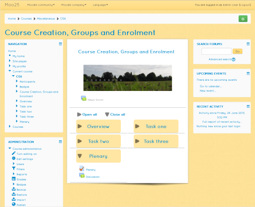

Introduction
============
Shoelace theme with a light feel through colour and font selection.

About
=====
 * copyright  &copy; 2013-onwards G J Barnard in respect to modifications of the Clean theme.
 * author     G J Barnard - http://about.me/gjbarnard and http://moodle.org/user/profile.php?id=442195
 * author     Based on code originally written by Mary Evans, Bas Brands, Stuart Lamour and David Scotson.
 * license    http://www.gnu.org/copyleft/gpl.html GNU GPL v3 or later

Maintained by
=============
G J Barnard MSc. BSc(Hons)(Sndw). MBCS. CEng. CITP. PGCE.
Moodle profile | http://moodle.org/user/profile.php?id=442195
Web profile | http://about.me/gjbarnard

Free Software
=============
The Shoelace theme is 'free' software under the terms of the GNU GPLv3 License, please see 'COPYING.txt'.

It can be obtained for free from:
https://moodle.org/plugins/view.php?plugin=theme_shoelace
and
https://github.com/gjb2048/moodle-theme_shoelace/releases

You have all the rights granted to you by the GPLv3 license.  If you are unsure about anything, then the
FAQ - http://www.gnu.org/licenses/gpl-faq.html - is a good place to look.

If you reuse any of the code then I kindly ask that you make reference to the theme.

If you make improvements or bug fixes then I would appreciate if you would send them back to me by forking from
https://github.com/gjb2048/moodle-theme_shoelace and doing a 'Pull Request' so that the rest of the
Moodle community benefits.

Support
=======
As Shoelace is licensed under the GNU GPLv3 License it comes with NO support.  If you would like support from
me then I'm happy to provide it for a fee (please see my contact details above).  Otherwise, the 'Themes' forum:
moodle.org/mod/forum/view.php?id=46 is an excellent place to ask questions.

Donations
=========
This theme is provided to you for free, and if you want to express your gratitude for using this theme, please consider donating
by:

PayPal - Please contact me via my 'Moodle profile' (above) for details as I am an individual and therefore am unable to have
'donation' / 'buy me now' buttons under their terms.

Flattr - https://flattr.com/profile/gjb2048

Donations may allow me to provide you with more or better features in less time.

Customisation
=============
If you like this theme and would like me to customise it, transpose functionality to another theme or build a new theme
from scratch, then I offer competitive rates.  Please contact me via www.gjbarnard.co.uk/contact/ or gjbarnard at gmail dot com
to discuss your requirements.

Required version of Moodle
==========================
This version works with Moodle version 2015051100.00 release 2.9 (Build: 20150511) and above within the 2.9 branch until the
next release.

Please ensure that your hardware and software complies with 'Requirements' in 'Installing Moodle' on
'docs.moodle.org/29/en/Installing_Moodle'.

Installation
============
 1. Ensure you have the version of Moodle as stated above in 'Required version of Moodle'.  This is essential as the
    theme relies on underlying core code that is out of my control.
 2. Login as an administrator and put Moodle in 'Maintenance Mode' so that there are no users using it bar you as the administrator.
 3. Copy the extracted 'shoelace' folder to the '/theme/' folder.
 4. Go to 'Site administration' -> 'Notifications' and follow standard the 'plugin' update notification.
 5. Select as the theme for the site.
 6. Put Moodle out of Maintenance Mode.

Upgrading
=========
 1. Ensure you have the version of Moodle as stated above in 'Required version of Moodle'.  This is essential as the
    theme relies on underlying core code that is out of my control.
 2. Login as an administrator and put Moodle in 'Maintenance Mode' so that there are no users using it bar you as the administrator.
 3. Make a backup of your old 'shoelace' folder in '/theme/' and then delete the folder.
 4. Copy the replacement extracted 'shoelace' folder to the '/theme/' folder.
 5. Go to 'Site administration' -> 'Notifications' and follow standard the 'plugin' update notification.
 6. If automatic 'Purge all caches' appears not to work by lack of display etc. then perform a manual 'Purge all caches'
   under 'Home -> Site administration -> Development -> Purge all caches'.
 7. Put Moodle out of Maintenance Mode.

Uninstallation
==============
 1. Put Moodle in 'Maintenance Mode' so that there are no users using it bar you as the administrator.
 2. Change the theme to another theme of your choice.
 3. In '/theme/' remove the folder 'shoelace'.
 4. Put Moodle out of Maintenance Mode.

Reporting Issues
================
Before reporting an issue, please ensure that you are running the latest version for your release of Moodle.  It is essential
that you are operating the required version of Moodle as stated at the top - this is because the theme relies on core
functionality that is out of its control.

I operate a policy that I will fix all genuine issues for free.  Improvements are at my discretion.  I am happy to make bespoke
customisations / improvements for a negotiated fee. 

When reporting an issue you can post in the theme's forum on Moodle.org (currently 'moodle.org/mod/forum/view.php?id=46')
or contact me direct (details at the bottom).

It is essential that you provide as much information as possible, the critical information being the contents of the format's 
version.php file.  Other version information such as specific Moodle version, theme name and version also helps.  A screen shot
can be really useful in visualising the issue along with any files you consider to be relevant.

Version Information
===================
Version 2.9.0.2 - Release candidate.
  1. Tidy up dropdowns.
  2. Fix some svg core icons.
  3. Fixed course category icons.
  4. Fixed missing inclusion of 'custom.css'.
  5. Fixed grader report page.
  6. Migrated to new context_header().
  7. Migrated core renderer to use class autoloading.
  8. Updated required 'bootstrapbase' version to that in M2.9.
  9. Tidied up inverse navbar.
 10. Removed theme colour from background on drop-down menus for a cleaner look.
 11. Removed the text shadow on the button text.

23rd April 2015 - Version 2.9.0.1
  1. Moodle 2.9 development version.
  2. Converted to using the PHP LESS compiler instead of Grunt manually.
  3. Improved, cleaner look.
  4. Added setting to change the colour for the theme.

10th April 2015 - Version 2.8.2.1
  1. Slight tweak to coursename icon in front page combo list.
  2. Style tweaks.
  3. Fixed drop down caret being white on white on front page section when editing on if navbar text is white.
  4. Fixed overflowing tables issue - see: https://moodle.org/mod/forum/discuss.php?d=279883.
  5. Tidy up when have no blocks showing on a two column page and not editing.
  6. Fix new messages popup so no conflict with 'go to top' icon.

 5th February 2015 - Version 2.8.2
  1. Added dynamic marketing region to frontpage.
  2. Fixed 'shoelaceblocks' to allow drag and drop of blocks when editing and there are no existing blocks in the region.
  3. Update to FontAwesome 4.3.0.
  4. Update to core version of the user menu.
  5. Slight cosmetic tweaks.

22nd December 2014 - Version 2.8.1.3
  1. Fix svg files not having 'viewbox' property for IE.

20th December 2014 - Version 2.8.1.2.
  1. Fix course name icon.

20th December 2014 - Version 2.8.1.1.
  1. Cross fix from Essential of Grade Single View Report with Groups, issue: 409.
  2. CDN Font Awesome to 4.2.0.

 5th December 2014 - Version 2.8.1 - First stable release.
  1. Stable version for Moodle 2.8.
  2. Update to FontAwesome 4.2.0.
  3. Update Gruntfile.js.
  4. Added jQuery for back to top functionality.

16th November 2014 - Version 2.8.0.1 - Release candidate.
  1. Release candidate for Moodle 2.8.

17th August 2014 - Version 2.7.1.1
  1.  Implement suggested fix for MDL-42634.

14th August 2014 - Version 2.7.1 - Stable.
  1.  Update grunt task versions.
  2.  Implement svgmin from Shoehorn and apply.
  3.  Regenerate CSS against Moodle '2.7.1+ (Build: 20140807).

12th June 2014 - Version 2.7.0.2 - Beta.
  1.  Added Grunt compile script for creating CSS and SVG icons.

23rd May 2014 - Version 2.7.0.1 - Beta.
  1.  Initial beta version for Moodle 2.7.
  2.  Updated FontAwesome to 4.1.0.
  3.  Changed user icons to svg.
  4.  Added core 'e' pix folder that is new in M2.7.

30th March 2014 - Version 2.6.1.4
  1.  Fixed 'installable' issue with OTF version of FontAwesome locally in IE by removing the OTF file as a source, see:
      https://github.com/FortAwesome/Font-Awesome/issues/2517

17th March 2014 - Version 2.6.1.3
  1.  Put back logo serving code that was accidentally removed in version 2.6.0.2.
  2.  Note: The moodle.css file has been compiled against Moodle 2.6.2+ (Build: 20140314), if you need a previous version or are
            experiencing odd things, please recompile using the instructions in less/Readme_Less.md.

 6th March 2014 - Version 2.6.1.2
  1.  Fixed HTML blocks having centred content in the footer block.
  2.  Made all footer blocks the same height when editing so that they are easier to move.  Also prevents blocks becoming orphaned
      on a row when they should be on the next.
  3.  Updated LESS build process to no longer overwrite bootstrap variables.less file.

24th February 2014 - Version 2.6.1.1.
  1.  Fix situation where the 'cdnfonts' setting has not been created.
  2.  Added in FontAwesome used in the breadcrumb.
  3.  Fix editor sheet in wrong place in the configuration.
  4.  Implemented MDL-44074 for footer blocks.
  5.  Optimised header code by using tiles.
  6.  Applied a slightly better colour scheme using a purple colour for the text.
  7.  Updated the paper shadow effect.

 2nd January 2014 - Version 2.6.1 - Stable.
  1.  Implemented MDL-43348.
  2.  Recompiled LESS as a result of MDL-41788 and MDL-43062.
  3.  Updated screen shot to reflect updates.

30th November 2013 Version 2.6.0.3
  1.  Added ability to choose between local and CDN sources for fonts.  This means that I had to change Quicksand for Cabin
      as quite frankly the former looked awful when coming from CDN.  This was because I had used it as a content font but
      the variety available on CDN was limited and switching it around as the header with Varela Round did not look good
      either.  Thanks to Julian Ridden for showing the way with this.

29th November 2013 Version 2.6.0.2
  1.  Added popup layout from bootstrapbase.
  2.  Removed excluded grade sheet.
  3.  Updated to use M2.6 font serving mechanism.

15th November 2013 Version 2.6.0.1
  1.  Initial BETA code for Moodle 2.6.

 6th November 2013 Version 2.5.3 - Stable.
  1.  Fixed footer blocks showing up where they should not on single column pages.
  2.  Updated styles.

24th October 2013 Version 2.5.3 - BETA
  1.  Added footer blocks with a setting to set the maximum number of blocks per 'row' between 1 and 4.
  2.  Added the 'less' folder containing the files required to alter / recompile the css.  Instructions
      in the 'less/Readme_less.md' file.

16th August 2013 Version 2.5.2.2.
  1.  Implemented MDL-36011.
  2.  Adjusted table cell widths - https://moodle.org/mod/forum/discuss.php?d=234329.
  3.  Implemented $CFG->themedir safe font serving.
  4.  Improvements to grade book styling thanks to Julian Ridden.

29th July 2013 Version 2.5.2.1 - Maintenance release.
  1.  Implemented MDL-39812, MDL-39299, MDL-39748, MDL-40082, MDL-40071, MDL-40189, MDL-40589 and MDL-40544.
  2.  Added new font 'Varela Round' for headings so that they are separated from the main text.
  3.  Block headings are no longer all upper case as this looks silly.
  4.  Blocks use the warning background and border scheme so that they do not dominate the page.
  5.  Tidied up form buttons on screen sizes less than 480px.

29th June 2013 Version 2.5.2.
  1.  Updated to changes implemented by MDL-39824 and proposed by MDL-40065 but in a way that they are local to Shoelace and
      therefore should not require an update to core M2.5.
  2.  Updated styles to current fixes.
  3.  Added 'icon.png' to show when updating.
  4.  Implemented MDL-40137 to fix method names in 'lib.php'.
  5.  Fixes for RTL.
  6.  Changes to course CSS using Mary Evan's Afterburner code as documented on: https://moodle.org/mod/forum/discuss.php?d=230919.
  7.  Use chevron icons for the breadcrumb divider.  Correct direction used in both LTR and RTL.
  8.  Use 'pills' instead of 'tabs' for 'tabtree's -> http://twitter.github.io/bootstrap/components.html#navs.

 6th June 2013 Version 2.5.1.2
  1.  Adjusted layout such that both pre and post blocks appear on the left for left to right languages and on the right
      for right to left languages.
  2.  Added paper effect.
  3.  Tidied up some small font / background issues.

31st May 2013 Version 2.5.1.1
  1.  Tweaked css for course search box on the course category page.
  2.  Updated layouts from core.
  3.  Adjusted custom css setting so that when it changes its effects are applied immediately.
  4.  Fixed inverse setting.
  5.  Fixed no purge when setting footnote.
  6.  Reversed this version information list to make the latest updates easier to find.

15th May 2013 Version 2.5.1 - Stable
  1.  First stable version for Moodle 2.5 stable.
  2.  Updated 'general.php' file from 'bootstrapbase'.

13th May 2013 - Version 2.5.0.5 - Beta.
  1.  Removed language menu as appears to now rendering from Bootstrap Base.
  2.  Made configuration of maintenance template like other standard themes.
  3.  Updated moodle.css in line with updates in Bootstrap Base.
  4.  Made font easier to change.

 8th May 2013 - Version 2.5.0.4 - Beta.
  1.  Added and adapted image from flexible sections course format.
  2.  Added and adapted missing move here image from core.
  3.  Added display of language menu when required.
  4.  Added automatic 'Purge all caches' when upgrading.  If this appears not to work by lack of display etc. then perform a
      manual 'Purge all caches' under 'Home -> Site administration -> Development -> Purge all caches'.

 4th May 2013 - Version 2.5.0.3 - Beta.
  1.  Added bootstrapbase dependency in 'config.php'.
  2.  Changed colour of form headings from black to blue.
  3.  Added 'Upgrading' instructions and made some improvements to this readme.
  4.  Changed as many core images to blue as possible.
  5.  Fixed font path issue when Moodle is in a sub-folder.
  6.  Please perform a 'Purge all caches' under 'Home -> Site administration -> Development -> Purge all caches' when upgrading.

29th April 2013 - Version 2.5.0.2 - Beta
  1.  Updated to using 'Bootstrapbase' as a parent theme, thus requiring Moodle version 2013042600.00 release 2.5beta+ (Build: 20130426).
  2.  Updated 'general.php' layout file from new 'Clean' theme that was renamed from 'Simple'.  Appears to have fixed logo not showing issue
  3.  Changed 'config.php' to no longer exclude settings and navigation sheets.  Excluding them means that the naviagation block does not
      render correctly.
  4.  Adapted the css such that there is now a clean white background whilst retaining the sandy colour for the header and other elements such
      as tables.
  5.  Mary Evans now on board as a maintainer and co-developer :).
  6.  Please perform a 'Purge all caches' under 'Home -> Site administration -> Development -> Purge all caches' when upgrading.

24th April 2013 - Version 2.5.0.1 - Beta
  1.  Initial version for Moodle 2.5beta.

Thanks
======
My thanks go to all the creators and participants of the Bootstrap theme:
Bas Brands, David Scotson, Stuart Lamour, Mark Aberdour, Paul Hibbitts and Mary Evans.

And again to Mary Evans for the 'Clean' theme.

Me
==
G J Barnard MSc. BSc(Hons)(Sndw). MBCS. CEng. CITP. PGCE.
Moodle profile: http://moodle.org/user/profile.php?id=442195
Web profile   : http://about.me/gjbarnard
